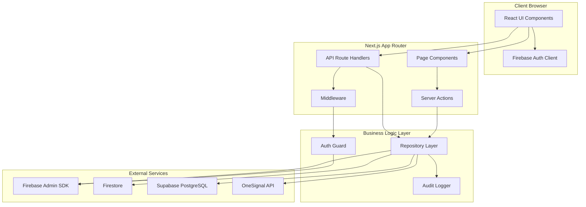
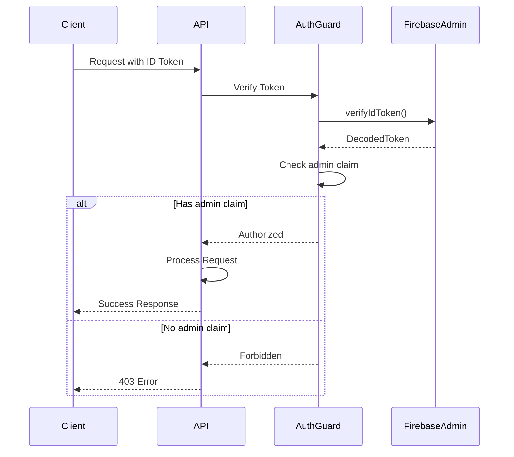

# Design Document

## Overview

The UniRide Admin WebApp is a Next.js 14+ application using the App Router architecture with TypeScript. The system implements a hybrid backend strategy, connecting to Firebase for authentication and legacy data, and Supabase for operational data. The application follows a layered architecture with clear separation between presentation, business logic, and data access layers.

The design prioritizes security (server-only credential handling), real-time capabilities (Supabase Realtime and Firestore snapshots), and maintainability (modular repository pattern with single responsibility).

## Architecture

### System Architecture Diagram



### Layered Architecture

**Presentation Layer (Client)**
- React Server Components for initial page loads
- React Client Components for interactive elements
- Tailwind CSS for styling
- Real-time subscriptions for live data updates

**Application Layer (Next.js)**
- API Route Handlers for RESTful endpoints
- Server Actions for form submissions and mutations
- Middleware for authentication and authorization
- Error boundary components for graceful error handling

**Business Logic Layer**
- Repository pattern for data access abstraction
- Auth guard for admin claim verification
- Audit logger for tracking all mutations
- Validation schemas using Zod

**Data Layer**
- Firebase Admin SDK for authentication and Firestore access
- Supabase client for PostgreSQL operations
- OneSignal REST API for push notifications

### Data Flow Patterns

**Read Operations:**
1. Client requests data via Server Component or API call
2. Server verifies admin token via auth guard
3. Repository fetches data from Firebase/Supabase
4. Data is validated and transformed
5. Response returned to client

**Write Operations:**
1. Client submits mutation via Server Action or API call
2. Server verifies admin token via auth guard
3. Repository validates input with Zod schemas
4. Repository performs database operation
5. Audit logger records the action
6. Success/error response returned to client

**Real-Time Updates:**
1. Client component subscribes to Supabase Realtime channel or Firestore snapshot
2. Server-side changes trigger real-time events
3. Client receives updates and re-renders affected components

## Components and Interfaces

### Core Modules

#### 1. Authentication Module

**Location:** `lib/security/`

**Components:**
- `authGuard.ts` - Admin claim verification
- `middleware.ts` - Route protection

**Key Functions:**
```typescript
// Verify Firebase ID token and admin claim
export async function assertAdmin(idToken: string): Promise<DecodedIdToken>

// Extract token from request headers
export function extractToken(request: Request): string | null

// Middleware for protected routes
export async function middleware(request: NextRequest): Promise<NextResponse>
```

#### 2. Firebase Module

**Location:** `lib/firebase/`

**Components:**
- `admin.ts` - Firebase Admin SDK initialization
- `client.ts` - Firebase client SDK for browser

**Key Exports:**
```typescript
// Server-side only
export const authAdmin: Auth
export const firestoreAdmin: Firestore

// Client-side
export const auth: FirebaseAuth
export const firestore: FirebaseFirestore
```

**Initialization Pattern:**
```typescript
// Singleton pattern with environment variable validation
if (!getApps().length) {
  initializeApp({
    credential: cert({
      projectId: process.env.FIREBASE_PROJECT_ID!,
      clientEmail: process.env.FIREBASE_CLIENT_EMAIL!,
      privateKey: process.env.FIREBASE_PRIVATE_KEY!.replace(/\\n/g, '\n'),
    }),
  });
}
```

#### 3. Supabase Module

**Location:** `lib/supabase/`

**Components:**
- `server.ts` - Supabase client with service role key (server-only)
- `types.ts` - TypeScript types for database schema

**Key Exports:**
```typescript
// Server-side only - never expose to client
export const supabase: SupabaseClient

// Type-safe database access
export type Database = {
  public: {
    Tables: {
      rides: { Row: Ride; Insert: RideInsert; Update: RideUpdate }
      // ... other tables
    }
  }
}
```

#### 4. Repository Layer

**Location:** `lib/repos/`

**Pattern:** Each repository encapsulates data access for a specific domain entity.

**UsersRepository (`usersRepo.ts`):**
```typescript
export class UsersRepository {
  // List users with filters and pagination
  async listUsers(filters: UserFilters, pagination: Pagination): Promise<PaginatedResult<User>>
  
  // Get single user by UID
  async getUserByUid(uid: string): Promise<User | null>
  
  // Verify rider application
  async verifyRider(uid: string, approved: boolean, note?: string): Promise<void>
  
  // Ban user
  async banUser(uid: string, reason: string): Promise<void>
  
  // Delete user (soft delete preferred)
  async deleteUser(uid: string): Promise<void>
  
  // Get user from both Firebase and Supabase
  private async getUserComposite(uid: string): Promise<User>
}
```

**RidesRepository (`ridesRepo.ts`):**
```typescript
export class RidesRepository {
  async listRides(filters: RideFilters, pagination: Pagination): Promise<PaginatedResult<Ride>>
  async getRideById(id: string): Promise<Ride | null>
  async cancelRide(id: string, reason: string, adminUid: string): Promise<void>
  async forceCompleteRide(id: string, adminUid: string): Promise<void>
  async getRideChat(rideId: string): Promise<ChatMessage[]>
  async getRideRatings(rideId: string): Promise<Rating[]>
}
```

**TrustRepository (`trustRepo.ts`):**
```typescript
export class TrustRepository {
  async getTrustRanking(filters: TrustFilters, pagination: Pagination): Promise<PaginatedResult<UserTrust>>
  async getTrustBreakdown(uid: string): Promise<TrustBreakdown>
  async recalculateTrustScore(uid: string): Promise<TrustScore>
  async getTrustOutliers(below?: number, above?: number): Promise<UserTrust[]>
  
  // Trust score calculation logic
  private calculateTrustScore(stats: UserStats): TrustScore
}
```

**ReportsRepository (`reportsRepo.ts`):**
```typescript
export class ReportsRepository {
  async listReports(filters: ReportFilters, pagination: Pagination): Promise<PaginatedResult<Report>>
  async getReportById(id: string): Promise<Report | null>
  async resolveReport(id: string, resolutionNote: string, adminUid: string): Promise<void>
  async escalateReport(id: string, reason: string, adminUid: string): Promise<void>
}
```

**NotificationsRepository (`notificationsRepo.ts`):**
```typescript
export class NotificationsRepository {
  async listNotifications(userUid?: string, unreadOnly?: boolean): Promise<Notification[]>
  async broadcastNotification(payload: BroadcastPayload, adminUid: string): Promise<void>
  async markAsRead(id: string): Promise<void>
  async deleteNotification(id: string): Promise<void>
  
  // OneSignal integration
  private async sendPushNotification(userUids: string[], title: string, message: string, data?: any): Promise<void>
}
```

**AuditRepository (`auditRepo.ts`):**
```typescript
export class AuditRepository {
  async logAction(entry: AuditLogEntry): Promise<void>
  async listAuditLogs(filters: AuditFilters, pagination: Pagination): Promise<PaginatedResult<AuditLog>>
  async getAuditLogById(id: string): Promise<AuditLog | null>
}
```

#### 5. Validation Module

**Location:** `lib/validation/schemas.ts`

**Zod Schemas:**
```typescript
// User filters
export const userFiltersSchema = z.object({
  query: z.string().optional(),
  role: z.enum(['rider', 'passenger', 'both']).optional(),
  verificationStatus: z.enum(['pending', 'approved', 'rejected']).optional(),
  trustMin: z.number().min(0).max(100).optional(),
  trustMax: z.number().min(0).max(100).optional(),
})

// Pagination
export const paginationSchema = z.object({
  page: z.number().int().positive().default(1),
  pageSize: z.number().int().positive().max(100).default(50),
})

// Rider verification
export const verifyRiderSchema = z.object({
  approved: z.boolean(),
  note: z.string().optional(),
})

// Broadcast notification
export const broadcastSchema = z.object({
  title: z.string().min(1).max(100),
  message: z.string().min(1).max(500),
  segment: z.string().optional(),
  userUids: z.array(z.string()).optional(),
})

// ... additional schemas for all API inputs
```

#### 6. Utility Modules

**CSV Export (`utils/csv.ts`):**
```typescript
export function generateCSV<T>(data: T[], fields: string[]): string
export function downloadCSV(filename: string, content: string): void
```

**Formatting (`utils/formatting.ts`):**
```typescript
export function formatDate(date: Date | string): string
export function formatCurrency(amount: number): string
export function formatTrustScore(score: number): { value: number; category: string; color: string }
export function truncateText(text: string, maxLength: number): string
```

### API Route Structure

**Endpoint Pattern:**
```
/api/{resource}/route.ts          - Collection operations (GET list, POST create)
/api/{resource}/[id]/route.ts     - Item operations (GET, PATCH, DELETE)
/api/{resource}/[id]/{action}/route.ts - Specific actions
```

**Standard Response Envelope:**
```typescript
type ApiResponse<T> = 
  | { ok: true; data: T }
  | { ok: false; error: { code: string; message: string } }
```

**Error Code Mapping:**
- `UNAUTHORIZED` → 401
- `FORBIDDEN` → 403
- `NOT_FOUND` → 404
- `VALIDATION_ERROR` → 400
- `CONFLICT` → 409
- `INTERNAL_ERROR` → 500

### Page Components Structure

**Layout Hierarchy:**
```
app/
  layout.tsx                    - Root layout with providers
  (admin)/
    layout.tsx                  - Admin layout with navigation
    dashboard/page.tsx          - Overview dashboard
    users/
      page.tsx                  - Users list
      [uid]/page.tsx            - User detail
    rides/
      page.tsx                  - Rides list
      [id]/page.tsx             - Ride detail
    requests/page.tsx           - Requests queue
    trust/page.tsx              - Trust rankings
    reports/page.tsx            - Reports triage
    notifications/page.tsx      - Notifications console
    config/page.tsx             - App config editor
    audit/page.tsx              - Audit log viewer
```

**Shared Components:**
```
components/
  layout/
    AdminNav.tsx              - Navigation sidebar
    Header.tsx                - Top header with user menu
  tables/
    DataTable.tsx             - Reusable table with sorting/filtering
    Pagination.tsx            - Pagination controls
  forms/
    FilterBar.tsx             - Filter controls
    ConfirmDialog.tsx         - Confirmation modal
  cards/
    StatCard.tsx              - Dashboard stat card
    UserCard.tsx              - User summary card
  charts/
    TrustScoreChart.tsx       - Trust score visualization
```

## Data Models

### Core Types

**User (Composite from Firebase + Supabase):**
```typescript
interface User {
  uid: string
  email: string
  displayName: string
  photoURL?: string
  phoneNumber?: string
  role: 'rider' | 'passenger' | 'both'
  isRiderVerified: boolean
  riderVerificationStatus: 'pending' | 'approved' | 'rejected'
  createdAt: Date
  // From Supabase user_stats
  trustScore: number
  totalRides: number
  completedRides: number
  averageRating: number
  cancellations: number
  lateCancellations: number
  noShows: number
}
```

**Ride:**
```typescript
interface Ride {
  id: string
  ownerUid: string
  fromLocation: string
  fromLat: number
  fromLng: number
  toLocation: string
  toLat: number
  toLng: number
  departAt: Date
  seatsTotal: number
  seatsAvailable: number
  price: number
  vehicleInfo?: string
  notes?: string
  status: RideStatus
  visible: boolean
  matchedAt?: Date
  riderUid?: string
  passengerUid?: string
  confirmationDeadline?: Date
  riderConfirmedGoing: boolean
  passengerConfirmedGoing: boolean
  riderConfirmedCompletion: boolean
  passengerConfirmedCompletion: boolean
  cancelledAt?: Date
  cancelledByUid?: string
  cancellationReason?: string
  cancellationFee?: number
  completedAt?: Date
  metadata?: Record<string, any>
}

type RideStatus = 
  | 'active'           // Available for matching
  | 'matched'          // Matched, awaiting confirmation
  | 'confirmed'        // Both parties confirmed
  | 'ongoing'          // In progress
  | 'completed'        // Successfully completed
  | 'cancelled'        // Cancelled by rider/passenger/admin
  | 'expired'          // Confirmation deadline passed
```

**RideRequest:**
```typescript
interface RideRequest {
  id: string
  rideId: string
  passengerUid: string
  seatsRequested: number
  message?: string
  status: 'pending' | 'accepted' | 'declined' | 'expired'
  createdAt: Date
  updatedAt: Date
}
```

**Rating:**
```typescript
interface Rating {
  rideId: string
  raterUid: string
  ratedUid: string
  raterRole: 'rider' | 'passenger'
  rating: number // 1-5
  review?: string
  isVisible: boolean
  createdAt: Date
}
```

**Report:**
```typescript
interface Report {
  id: string
  reporterUid: string
  reportedUserUid: string
  rideId?: string
  type: 'harassment' | 'safety' | 'fraud' | 'other'
  description: string
  status: 'pending' | 'resolved' | 'escalated'
  resolutionNote?: string
  createdAt: Date
  updatedAt: Date
}
```

**Notification:**
```typescript
interface Notification {
  id: string
  userUid: string
  type: NotificationType
  title: string
  message: string
  actionData?: Record<string, any>
  isRead: boolean
  createdAt: Date
  updatedAt: Date
}

type NotificationType =
  | 'ride_matched'
  | 'ride_confirmed'
  | 'ride_cancelled'
  | 'ride_completed'
  | 'request_accepted'
  | 'request_declined'
  | 'rating_received'
  | 'report_resolved'
  | 'admin_broadcast'
```

**TrustScore:**
```typescript
interface TrustScore {
  total: number // 0-100
  category: 'Excellent' | 'Good' | 'Fair' | 'Poor'
  components: {
    rating: number      // 0-30
    completion: number  // 0-25
    reliability: number // 0-25
    experience: number  // 0-20
  }
}

interface TrustBreakdown extends TrustScore {
  userUid: string
  calculations: {
    rating: {
      averageRating: number
      totalRatings: number
      points: number
    }
    completion: {
      completionRate: number
      completedRides: number
      totalRides: number
      points: number
    }
    reliability: {
      cancellations: number
      lateCancellations: number
      noShows: number
      deductions: number
      points: number
    }
    experience: {
      totalRides: number
      points: number
    }
  }
}
```

**AuditLog:**
```typescript
interface AuditLog {
  id: string
  adminUid: string
  action: string // e.g., 'verify_rider', 'ban_user', 'cancel_ride'
  entityType: string // e.g., 'user', 'ride', 'report'
  entityId: string | null
  diff: {
    before?: any
    after?: any
  }
  createdAt: Date
}
```

### Database Schema

**Supabase Tables to Create:**

```sql
-- Admin audit log table
CREATE TABLE admin_audit_log (
  id UUID PRIMARY KEY DEFAULT gen_random_uuid(),
  admin_uid TEXT NOT NULL,
  action TEXT NOT NULL,
  entity_type TEXT NOT NULL,
  entity_id TEXT,
  diff JSONB,
  created_at TIMESTAMPTZ DEFAULT NOW()
);

CREATE INDEX idx_audit_log_admin ON admin_audit_log(admin_uid, created_at DESC);
CREATE INDEX idx_audit_log_entity ON admin_audit_log(entity_type, entity_id);
CREATE INDEX idx_audit_log_created ON admin_audit_log(created_at DESC);
```

**Recommended Indexes for Existing Tables:**

```sql
-- Rides indexes
CREATE INDEX IF NOT EXISTS idx_rides_status ON rides(status, matched_at DESC);
CREATE INDEX IF NOT EXISTS idx_rides_owner ON rides(owner_uid, created_at DESC);
CREATE INDEX IF NOT EXISTS idx_rides_depart ON rides(depart_at);

-- Ride requests indexes
CREATE INDEX IF NOT EXISTS idx_requests_ride ON ride_requests(ride_id, created_at DESC);
CREATE INDEX IF NOT EXISTS idx_requests_passenger ON ride_requests(passenger_uid, created_at DESC);
CREATE INDEX IF NOT EXISTS idx_requests_status ON ride_requests(status, created_at DESC);

-- Reports indexes
CREATE INDEX IF NOT EXISTS idx_reports_status ON reports(status, created_at DESC);
CREATE INDEX IF NOT EXISTS idx_reports_reported ON reports(reported_user_uid, created_at DESC);

-- Notifications indexes
CREATE INDEX IF NOT EXISTS idx_notifications_user ON notifications(user_uid, created_at DESC);
CREATE INDEX IF NOT EXISTS idx_notifications_unread ON notifications(user_uid, is_read, created_at DESC);

-- User stats indexes
CREATE INDEX IF NOT EXISTS idx_user_stats_trust ON user_stats(trust_score DESC);
```

## Error Handling

### Error Handling Strategy

**Layered Error Handling:**

1. **Validation Layer** - Zod schema validation catches input errors
2. **Repository Layer** - Database and external API errors
3. **API Layer** - HTTP error responses with standard envelope
4. **UI Layer** - User-friendly error messages and fallback UI

**Error Types:**

```typescript
class AppError extends Error {
  constructor(
    public code: string,
    public message: string,
    public statusCode: number,
    public details?: any
  ) {
    super(message)
  }
}

class ValidationError extends AppError {
  constructor(message: string, details?: any) {
    super('VALIDATION_ERROR', message, 400, details)
  }
}

class UnauthorizedError extends AppError {
  constructor(message = 'Unauthorized') {
    super('UNAUTHORIZED', message, 401)
  }
}

class ForbiddenError extends AppError {
  constructor(message = 'Forbidden') {
    super('FORBIDDEN', message, 403)
  }
}

class NotFoundError extends AppError {
  constructor(resource: string) {
    super('NOT_FOUND', `${resource} not found`, 404)
  }
}
```

**Error Handler Utility:**

```typescript
export function handleApiError(error: unknown): Response {
  console.error('API Error:', error)
  
  if (error instanceof AppError) {
    return Response.json(
      { ok: false, error: { code: error.code, message: error.message } },
      { status: error.statusCode }
    )
  }
  
  if (error instanceof z.ZodError) {
    return Response.json(
      { ok: false, error: { code: 'VALIDATION_ERROR', message: error.errors[0].message } },
      { status: 400 }
    )
  }
  
  return Response.json(
    { ok: false, error: { code: 'INTERNAL_ERROR', message: 'An unexpected error occurred' } },
    { status: 500 }
  )
}
```

### Graceful Degradation

**Supabase Outage:**
- Display cached data with staleness indicator
- Queue mutations for retry
- Show user-friendly error message

**Firebase Outage:**
- Block authentication-dependent operations
- Show maintenance message
- Allow read-only access to cached data

**OneSignal Outage:**
- Persist notifications to database
- Skip push notification delivery
- Log failure for manual retry

## Testing Strategy

### Unit Testing

**Target:** Repository layer, utility functions, validation schemas

**Tools:** Jest, ts-jest

**Example Test Structure:**

```typescript
// __tests__/repos/usersRepo.test.ts
describe('UsersRepository', () => {
  let repo: UsersRepository
  let mockSupabase: jest.Mocked<SupabaseClient>
  let mockFirestore: jest.Mocked<Firestore>
  
  beforeEach(() => {
    mockSupabase = createMockSupabaseClient()
    mockFirestore = createMockFirestore()
    repo = new UsersRepository(mockSupabase, mockFirestore)
  })
  
  describe('listUsers', () => {
    it('should return paginated users with filters', async () => {
      // Arrange
      const filters = { trustMin: 50, trustMax: 100 }
      const pagination = { page: 1, pageSize: 10 }
      
      // Act
      const result = await repo.listUsers(filters, pagination)
      
      // Assert
      expect(result.data).toHaveLength(10)
      expect(result.total).toBeGreaterThan(0)
    })
  })
  
  describe('verifyRider', () => {
    it('should approve rider verification', async () => {
      // Test implementation
    })
    
    it('should reject rider verification with note', async () => {
      // Test implementation
    })
  })
})
```

### Integration Testing

**Target:** API route handlers

**Tools:** Jest, node-mocks-http or supertest

**Example:**

```typescript
// __tests__/api/users.test.ts
describe('GET /api/users', () => {
  it('should return 401 without auth token', async () => {
    const response = await request(app).get('/api/users')
    expect(response.status).toBe(401)
  })
  
  it('should return paginated users with valid admin token', async () => {
    const token = await generateTestAdminToken()
    const response = await request(app)
      .get('/api/users?page=1&pageSize=10')
      .set('Authorization', `Bearer ${token}`)
    
    expect(response.status).toBe(200)
    expect(response.body.ok).toBe(true)
    expect(response.body.data).toHaveProperty('data')
    expect(response.body.data).toHaveProperty('total')
  })
})
```

### E2E Testing (Future)

**Target:** Critical user flows

**Tools:** Playwright

**Flows to Test:**
- Admin login and navigation
- User verification workflow
- Ride cancellation with audit log verification
- Broadcast notification sending

## Performance Considerations

### Pagination Strategy

- Default page size: 50 items
- Maximum page size: 100 items
- Use cursor-based pagination for large datasets (future optimization)

### Caching Strategy

**ISR (Incremental Static Regeneration):**
- Trust rankings page: revalidate every 60 seconds
- Dashboard stats: revalidate every 30 seconds

**React Query Client Cache:**
- Stale time: 30 seconds for list views
- Cache time: 5 minutes
- Automatic refetch on window focus for critical data

### Database Query Optimization

- Use selective field projection (only fetch needed columns)
- Implement proper indexes (see Data Models section)
- Use database views for complex aggregations (trust score breakdown)
- Batch operations where possible (bulk notifications)

### Real-Time Optimization

- Limit Realtime subscriptions to active views only
- Unsubscribe when components unmount
- Throttle high-frequency updates (e.g., typing indicators)
- Use Realtime filters to reduce payload size

## Security Considerations

### Authentication Flow



### Security Checklist

- ✅ Service role keys stored in server-only environment variables
- ✅ Admin claim verification on every write operation
- ✅ Input validation with Zod schemas
- ✅ SQL injection prevention via parameterized queries (Supabase client)
- ✅ XSS prevention via React's built-in escaping
- ✅ CSRF protection via SameSite cookies (future session implementation)
- ✅ Rate limiting on destructive operations (future implementation)
- ✅ Audit logging for all mutations
- ✅ Soft delete preferred over hard delete
- ✅ Confirmation dialogs for destructive actions

### Environment Variable Security

**Server-Only Variables:**
```
FIREBASE_PRIVATE_KEY
FIREBASE_CLIENT_EMAIL
FIREBASE_PROJECT_ID
SUPABASE_SERVICE_ROLE_KEY
ONESIGNAL_REST_API_KEY
ADMIN_SESSION_SECRET
```

**Client-Exposed Variables:**
```
NEXT_PUBLIC_SUPABASE_URL
NEXT_PUBLIC_ONESIGNAL_APP_ID
```

**Validation on Startup:**
```typescript
// lib/config/env.ts
const serverEnvSchema = z.object({
  FIREBASE_PROJECT_ID: z.string().min(1),
  FIREBASE_CLIENT_EMAIL: z.string().email(),
  FIREBASE_PRIVATE_KEY: z.string().min(1),
  SUPABASE_URL: z.string().url(),
  SUPABASE_SERVICE_ROLE_KEY: z.string().min(1),
  ONESIGNAL_REST_API_KEY: z.string().min(1),
})

export const serverEnv = serverEnvSchema.parse(process.env)
```

## Deployment Considerations

### Environment Setup

**Development:**
- Local Firebase emulator for auth testing
- Supabase local development instance
- Mock OneSignal API responses

**Staging:**
- Separate Firebase project
- Separate Supabase project
- OneSignal test app

**Production:**
- Production Firebase project
- Production Supabase project with backups
- Production OneSignal app
- CDN for static assets
- Edge middleware for auth

### Build Configuration

```javascript
// next.config.js
module.exports = {
  reactStrictMode: true,
  experimental: {
    serverActions: true,
  },
  env: {
    // Client-exposed variables
  },
  // Prevent server-only code in client bundles
  webpack: (config, { isServer }) => {
    if (!isServer) {
      config.resolve.alias = {
        ...config.resolve.alias,
        '@/lib/firebase/admin': false,
        '@/lib/supabase/server': false,
      }
    }
    return config
  },
}
```

### Monitoring and Observability

**Logging Strategy:**
- Structured JSON logs for server-side operations
- Log levels: ERROR, WARN, INFO, DEBUG
- Include request ID for tracing
- Log all admin actions via audit log

**Future Integrations:**
- Datadog for application monitoring
- Sentry for error tracking
- Firebase Analytics for usage metrics
- Supabase logs for database query performance

## Design Decisions and Rationales

### Why Next.js App Router?

- Server Components reduce client bundle size
- Built-in API routes eliminate need for separate backend
- Streaming and Suspense for better UX
- Edge middleware for fast auth checks

### Why Repository Pattern?

- Abstracts data source complexity (Firebase + Supabase)
- Enables easy mocking for unit tests
- Centralizes business logic
- Facilitates future migrations

### Why Hybrid Firebase + Supabase?

- Firebase: Existing auth infrastructure and user data
- Supabase: Better relational data modeling for operational data
- Supabase: Built-in Realtime subscriptions
- Supabase: PostgreSQL for complex queries and aggregations

### Why Zod for Validation?

- Type-safe schema validation
- Automatic TypeScript type inference
- Composable schemas
- Clear error messages

### Why Audit Logging in Supabase?

- Immutable append-only log
- Efficient querying with indexes
- Integrated with operational data
- PostgreSQL JSONB for flexible diff storage
